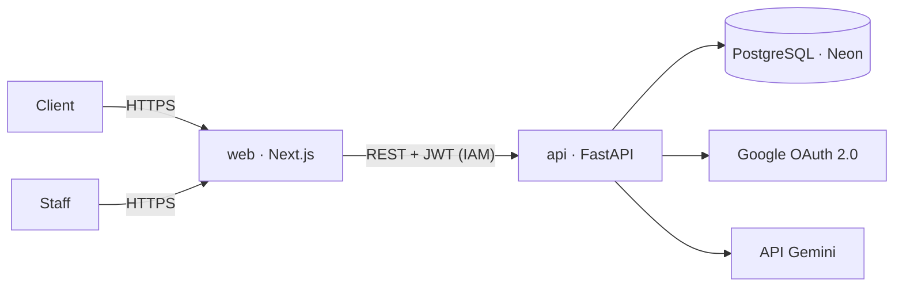

# Snacki

PWA de commande et de gestion pour **Snacki**, un snack de jus et desserts à Nouadhibou (Mauritanie) : les clients commandent en français ou en arabe et confirment sur WhatsApp, le staff tient la caisse et suit les commandes en direct, les associés pilotent les ventes. Une IA prévoit les achats de fruits et transforme les messages WhatsApp en commandes.

Le projet suit une démarche **DevSecOps** : la sécurité est contrôlée à chaque commit, du poste du développeur jusqu'à la production.

> État : **J1 / 15** · socle du dépôt, portes de sécurité et modèle de menaces. L'application arrive à partir de J2.

## Architecture



| Brique | Technologie |
| --- | --- |
| Front | TypeScript, Next.js, Tailwind (PWA FR/AR) |
| API | Python, FastAPI, Pydantic |
| Données | PostgreSQL (Neon), SQLAlchemy, Alembic |
| IA | scikit-learn (prévision), Gemini (assistant de commande) |
| Identité | OAuth 2.0 Google, JWT, rôles |
| Hébergement | Docker, Google Cloud Run |
| CI/CD | GitHub Actions, portes DevSecOps |

## Sécurité

| Porte | Outil | Active depuis |
| --- | --- | --- |
| 1 · Secrets | gitleaks (poste + CI), protection des pushs GitHub | J1 |
| 2 · Qualité et sécurité du code | ruff (règles `S`), Bandit | J1 |
| Chaîne d'approvisionnement | actions épinglées par SHA, Dependabot | J1 |
| 3–4 · Tests et autorisations | pytest | J3 |
| 5–7 · SAST, dépendances, image | CodeQL, Semgrep, pip-audit, Trivy | J5 |
| 8 · IA | jeu d'évaluation de l'assistant | J9 |
| 9 · Application en ligne | OWASP ZAP | J12 |

- [Modèle de menaces (STRIDE, 24 menaces)](docs/security/threat-model.md)
- [Suivi OWASP ASVS 5.0 niveau 1 (70 exigences)](docs/security/asvs-l1.md)
- [Décisions d'architecture](docs/adr/)
- [Politique de sécurité et délais de correction](SECURITY.md)

## Démarrer

Prérequis : Python 3.11+, Git, Graphviz (pour régénérer le schéma de flux).

```bash
python3 -m venv .venv && source .venv/bin/activate
pip install -r requirements-dev.txt
pre-commit install            # active les portes locales à chaque commit
pre-commit run --all-files    # vérifie tout le dépôt
pytest                        # tests des outils de sécurité
```

Travailler toujours sur une branche (`git switch -c j2-socle-api`) : `main` n'accepte que des pull requests.

## Organisation du dépôt

```
apps/api/        API FastAPI (à partir de J2)
apps/web/        PWA Next.js (à partir de J4)
docs/security/   modèle de menaces (as code + texte), ASVS, schéma de flux
docs/adr/        décisions d'architecture
infra/github/    réglages de sécurité du dépôt (branche protégée, alertes)
infra/gcp/       projet Google Cloud, API, alerte de budget
scripts/         outils Python : vérification du dépôt, ASVS, schéma de flux
tests/           tests des outils
```

## Licence

MIT, voir [LICENSE](LICENSE). Le texte de l'OWASP ASVS dans `docs/security/asvs/` reste sous CC BY-SA 4.0.
