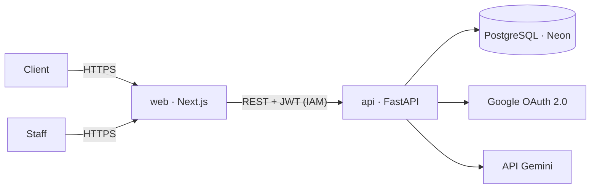

# Snacki

PWA de commande et de gestion pour **Snacki**, un snack de jus et desserts à Nouadhibou (Mauritanie) : les clients commandent en français ou en arabe directement dans l'app (WhatsApp reste un lien de contact), le staff tient la caisse et suit les commandes en direct, les associés pilotent les ventes. Une IA prévoit les achats de fruits et transforme les messages WhatsApp en commandes.

Le projet suit une démarche **DevSecOps** : la sécurité est contrôlée à chaque commit, du poste du développeur jusqu'à la production.

> État : **J8 / 15** · En ligne sur Cloud Run (staging puis production approuvée). Connexion du staff (J6), caisse (J7). Pilotage : chiffre d'affaires du jour, de la période et cumulé, produits les plus vendus, moyens de paiement, historique Excel importé ; coordonnées des clients anonymisées après 90 jours ([ADR 0010](docs/adr/0010-pilotage-et-historique.md)).

## Architecture



| Brique | Technologie |
| --- | --- |
| Front | TypeScript, Next.js, Tailwind (PWA FR/AR) |
| API | Python, FastAPI, Pydantic |
| Données | PostgreSQL (Neon), SQLAlchemy, Alembic |
| IA | scikit-learn (prévision), Gemini (assistant de commande) |
| Identité | OAuth 2.0 Google, JWT, rôles |
| Hébergement | Docker, Google Cloud Run |
| CI/CD | GitHub Actions, portes DevSecOps |

## Sécurité

| Porte | Outil | Active depuis |
| --- | --- | --- |
| 1 · Secrets | gitleaks (poste + CI), protection des pushs GitHub | J1 |
| 2 · Qualité et sécurité du code | ruff (règles `S`), Bandit | J1 |
| Chaîne d'approvisionnement | actions épinglées par SHA, Dependabot | J1 |
| 3 · Tests de l'API et du front | pytest sur PostgreSQL (couverture ≥ 80 %, migrations réversibles) ; Vitest, types et build Next.js | J2, J4 |
| 4 · Tests d'autorisation | pytest : accès croisé aux commandes (anti-BOLA) | J3 |
| 5 · Analyse du code (SAST) | CodeQL (Python, TypeScript), ruff `S`, Bandit | J5 |
| 6 · Dépendances (SCA) | pip-audit, npm audit, Dependabot | J5 |
| 7 · Images Docker | non root, aucun fichier inutile, Trivy | J5 |
| 8 · IA | jeu d'évaluation de l'assistant | J9 |
| 9 · Application en ligne | OWASP ZAP | J12 |

- [Modèle de menaces (STRIDE, 24 menaces)](docs/security/threat-model.md)
- [Suivi OWASP ASVS 5.0 niveau 1 (70 exigences)](docs/security/asvs-l1.md)
- [Décisions d'architecture](docs/adr/)
- [Politique de sécurité et délais de correction](SECURITY.md)

## Démarrer

Prérequis : Python 3.11+, Git, Graphviz (pour régénérer le schéma de flux).

```bash
python3 -m venv .venv && source .venv/bin/activate
pip install -r requirements-dev.txt
pre-commit install            # active les portes locales à chaque commit
pre-commit run --all-files    # vérifie tout le dépôt
pytest                        # tests des outils de sécurité
```

Travailler toujours sur une branche (`git switch -c j2-socle-api`) : `main` n'accepte que des pull requests.

## Déployer

Chaque fusion sur `main` déclenche `.github/workflows/deploy.yml` après une CI verte : images construites et analysées une fois, publiées dans Artifact Registry, déployées en **staging**, puis en **production** après approbation dans GitHub ([ADR 0007](docs/adr/0007-deploiement-cloud-run.md)). Aucune clé Google n'est stockée : GitHub s'authentifie par Workload Identity Federation.

| Service | Accès |
| --- | --- |
| `snacki-web-staging`, `snacki-web-prod` | public (HTTPS) |
| `snacki-api-staging`, `snacki-api-prod` | privé : seul le serveur web du même environnement peut l'appeler |

Mise en place, une seule fois : `./infra/gcp/setup-deploy.sh <projet> <propriétaire/dépôt>`, puis `./infra/gcp/setup-auth.sh` pour la connexion du staff ([ADR 0008](docs/adr/0008-connexion-du-staff.md)).

## Organisation du dépôt

```
apps/api/        API FastAPI (voir apps/api/README.md)
apps/web/        PWA Next.js (voir apps/web/README.md)
docs/security/   modèle de menaces (as code + texte), ASVS, schéma de flux
docs/adr/        décisions d'architecture
infra/github/    réglages de sécurité du dépôt (branche protégée, alertes)
infra/gcp/       projet Google Cloud, budget, déploiement (comptes, secrets, Cloud Run)
scripts/         outils Python : vérification du dépôt, ASVS, schéma de flux
tests/           tests des outils
```

## Licence

MIT, voir [LICENSE](LICENSE). Le texte de l'OWASP ASVS dans `docs/security/asvs/` reste sous CC BY-SA 4.0.
